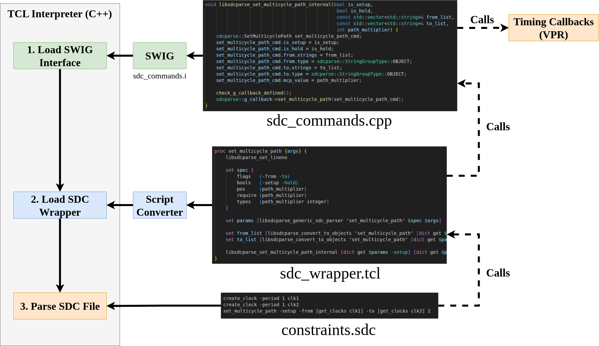

# Developer Docs

## TCL Interpreter for SDC Parsing

Synopsys Design Constraints (SDCs) are a set of TCL procedures that a user can call to constrain parts of their ASIC designs. SDC has been adopted by FPGA vendors to allow users to constrain aspects of their design (such as the clock frequencies). There are many SDC procedures that are not necessary for FPGAs, and so are often not supported. For FPGA designs, we are most interested in three sets of constraints:

1. Timing Constraints
2. Timing Exceptions
3. Object Queries

See the following documentation for more information: [FPGA Timing Suite Syntax Docs](https://github.com/siliconcompiler/fpga-timing-coverage-suite/tree/master/docs/syntax).

### The TCL Interpreter in C++

Due to SDC being necessarily a TCL file, SDCs are actually interpreted. This means that an SDC file is not executed line-by-line but is executed similarly to Python. As such, it is necessary for a fully SDC compliant parser to be a TCL interpreter.

Fortunately, it is somewhat trivial to construct a TCL interpreter since it is provided as a very well documented library. The [TCL/Tk](https://www.tcl-lang.org/) toolkits provide C APIs for creating and invoking a TCL interpreter. See the following [wiki page](https://wiki.tcl-lang.org/page/Adding+Tcl%2FTk+to+a+C+application) for more information.

The code to instantiate a TCL interpreter (using the library above) is in:
```txt
src/
    tcl/
        tcl_interpreter.h
```
This file defines a class which manages the TCL interpreter object (and makes it easier to work with in a C++ application).

### The SDC Wrapper File

If we just use the TCL interpreter as is, it will execute the SDC file as if it is TCL, but it will not know what to do when an SDC procedure is called (since these procedures have not been defined yet). What we need to do is define the TCL procedures for each of the SDC commands. This is done in a wrapper file found here:
```txt
src/
    tcl/
        sdc_wrapper.tcl
```
This wrapper file is loaded into the TCL interpreter in the constructor of the interpreter class.

This wrapper file parses the arguments for the SDC commands, verifies that they are valid, and then organizes the arguments. By doing this in TCL, it gives us the opportunity to "clean-up" the arguments of the SDC commands before handing them down into C++.

### Callbacks

We then hit our next problem. We do not want to write all of our code in TCL. Many downstream tools (VPR included) are written in C++. What we would like to happen is that when an SDC command is parsed, we want to execute some C++ code; specifically, we want the C++ code to come from the calling tool. This requires us to use a callback object. The callback object is defined in:
```txt
src/
    sdcparse.hpp
```
This is an object which will be inherited by the downstream tool and then a reference to the base class will be provided to the parser. When an SDC command is parsed, the corresponding callback will be called.

### SWIG

We are almost there, now we just need the glue logic to connect TCL to the C++ callbacks. We could directly program this interface into the TCL interpreter; however, we would prefer to use a cleaner approach which can easily add new callbacks when needed. To create this interface, we use [SWIG](https://www.swig.org/papers/Tcl98/TclChap.html). All of the SWIG interface files are defined in the following files:
```txt
src/
    tcl/
        sdc_commands.cpp
        sdc_commands.h
        sdc_commands.i
```
The `sdc_commands.i` file is a SWIG interface file. It defines how the C++ functions in sdc_commands.h will be turned into TCL procedures which can be called by our wrapper file. Each of these commands are "internal" commands which we do not expect a user to use directly on the TCL side.

The TCL interface procedures are generated during build time. This process is described within the top level `CMakeLists.txt` file.

The functions defined in `sdc_commands.cpp` are what actually take the information from the parser and passes it into the callback. Due to how SWIG is set up, the most convenient way to do this is by creating a global callback object pointer which is initialized by the interpreter and used within these functions.

### Importing the Procedures to the TCL Interpreter

We have now defined two sets of procedures, which act almost like libraries:
1. `sdc_wrapper.tcl`: Parses the SDC commands and preps them before sending them to the internal SWIG interface methods.
2. `sdc_commands.i`: The SWIG-generated TCL interface functions. These call the callbacks defined by the user.

We need to have these two libraries get loaded into the interpreter before the SDC file is parsed.

In SWIG, this is very easy. When the SWIG interface file is compiled, it generates a function that initializes the interface: `Sdc_commands_Init`. This function handles everything that we need to initialize these interfaces, so we call it in the constructor of the TCL interpreter.

The code found in `sdc_wrapper.tcl` is a bit more tricky. We could tell the user to keep this file around and load it before any SDC file; however, this is a bit annoying since it requires the user to manage this file. As a better solution, we can actually store this file in the binary executable (in the `.data` segment). The easiest way to do this is to generate a C++ function which will return this TCL file as a string. Then in the constructor of the interpreter, we interpret that string as a TCL file. This is what `script_converter.py` is doing. It converts `sdc_wrapper.tcl` into a C++ function which will return the script as a string. This function is then accessed by the interpreter through the function declaration defined in `sdc_wrapper.h`. At build time, the python script is invoked and the C++ file is generated. This can be found in the top-level `CMakeLists.txt`.

### Timing Object Database

In order to support commands such as `get_clocks` and `get_ports`, the parser needs to be aware of the names of all objects in the netlist. This is managed by the `TimingObjectDatabase` defined in:
```txt
src/
    sdc_timing_object_database.h
    sdc_timing_object.h
```
This database is accessible by the tool (i.e. VPR), allowing it to create different types of objects that it needs. For example, before parsing the SDC file, it is expected that VPR would create port objects for all ports in the netlist. The parser will then use that information to manage what to do when an SDC file contains the `get_ports` procedure.

All timing objects have unique IDs which act like pointers in TCL. To make the interface as easy as possible, on the TCL side, these objects appear as strings with a unique format: `__vtr_obj_<type>_<id>`. This is used to encode information about the object to make debugging easier. This is different from how other SDC parsers normally store these objects. Normally, these objects are stored as pointers to TCL objects. This is because these objects are accessed by other algorithms and are timing critical. Since the goal of this code is to just act like a parser, it is not as timing critical. So we would prefer the simplicity and debuggability of using strings instead.

### Overview of TCL-Based SDC Parser

The following figure provides an overview of how the different components of the TCL interpreter interact with one-another:



The TCL interpreter begins by registering the SWIG interface commands (defined in C++ and then generated by SWIG). It then parses and loads the SDC wrapper file (which is turned into a string by the script converter). It then parses the SDC file (which is provided directly by the user).

In this example, when `set_multicycle_path` is parsed, the procedure in `sdc_wrapper.tcl` is called. This parses the arguments of the SDC commands, checks the overall command is valid, and then passes the arguments to the internal SWIG interface function. This interface function then calls the `set_multicycle_path` callback which will run code in the tool (in this case, VPR).

## Unit Testing Framework

The unit testing framework for LibSDCParse is based off of [LLVM's Integration Tester](https://llvm.org/docs/CommandGuide/lit.html) (LIT) Framework. This is a high-quality testing framework that puts the run command for each testcase within the testcase itself. We then also use FileCheck (similar to LLVM) to ensure that the proper output is generated for each testcase. You will find all of the testing framework code in the `test/` directory.

LLVM-LIT is provided as part of the LLVM tool; however, it is unreasonable to include the entire LLVM project in this library just for unit testing; so, instead we use a [python version of the LIT tool](https://pypi.org/project/lit/). This works very similar to the original LLVM-LIT tool, however it is provided as a Python library. We can then create a basic Python script which will act like LLVM-LIT, which can be found at: `test/libsdcparse-lit.py`.

The test suite is configured by two config files which can be found here:
```txt
test/
    lit.cfg.py
    lit.site.cfg.py.in
```

`lit.site.cfg.py.in` defines environment variables which are not known until build time (such as the location of the build folder). This information is populated in the `test/CMakeLists.txt` file.

`lit.cfg.py` configures the test suite by pointing out which tests can be run and what commands they are able to use.

`test/CMakeLists.txt` creates custom targets which can be executed from the build folder using a make command, such as:
```sh
make check-libsdcparse
```
This will run the entire test suite (using as many cores as available).

There is another Python script found in the test folder: `test/not.py`. This is a helper script based on the `not` utility executable in LLVM. This Python script negates the return of an executable such that when the executable fails (returns 1), this script returns 0, and vice versa. This allows us to create test cases which are "expected to fail", such as syntax errors.

There is also a suppression file, `test/tcl.supp`, which is used to suppress known false-positives for Valgrind. Valgrind can be run using a custom executable defined in `test/CMakeLists.txt`:
```sh
make check-libsdcparse-vg
```

All other directories in the `test` folder will be traversed in search for test cases. All files which end in `.sdc` will be executed as a testcase.

At the top of each testcase, you will find a `RUN` command. This command tells LIT how to execute that script. See LLVM-LIT's documentation for more information on how this works.

In each testcase, you will find `CHECK` commands. These commands are used by FileCheck which ensures that the given line can be found in stdout. See the [FileCheck Docs](https://llvm.org/docs/CommandGuide/FileCheck.html) for more information; but in a nutshell, we are able to use pattern-matching to ensure that the correct output is generated by our testing scripts.

To run our testcases, we use a test executable called `sdcparse_test`. This executable is defined in `src/main.cpp`. This executable pretends like it is a downstream tool and whenever it sees a command, it prints that command and all of its arguments to standard out. In our testcases, we just ensure that the command that we put in is the command that is printed out.

### Adding a New Unit Test

Due to using the LIT testing framework, adding a new test is very easy.

#### 1. Create the test file

The unit test suite is set up to run any file in the `test/` directory (or any of its subdirectories) that end in `.sdc`. So all you need to do is create an SDC file in the appropriate folder. I generally put basic syntax tests in the `test/basic/` directory (these are also sent through Valgrind), and I put all other tests that test less-used features in the `test/strong/` directory.

#### 2. Add the RUN command to the top of the file

For all of the tests in this repository, the RUN command will look basically the same. At the top of the file, write the following:
```tcl
# RUN: %sdcparse-test %s 2>&1 | filecheck %s
```

This tells LIT to run the `sdcparse_test` executable on this test file (`%s` is a macro for the full path to this file), and then pipe the results of stdout and stderr to FileCheck. If you are not using Filecheck (if you are making a basic smoke test that ensures that it does not crash), you would just leave out the pipe to FileCheck.

If you are making a test that is expected to fail, the run command would look like this:
```tcl
# RUN: %not %sdcparse-test %s 2>&1 | filecheck %s
```

Notice that we are using the `%not` utility to negate the result of the `sdcparse_test` executable. This ensures that the executable fails correctly.

See some of the other tests for examples.

#### 3. Add the FileChecks

See the FileCheck documentation for more information on what the syntax should look like, but as a basic example:
```tcl
# RUN: %sdcparse-test %s 2>&1 | filecheck %s

# CHECK: Hello World!
puts "Hello World!"
```

This file runs the parser executable. This will generate the string "Hello World!" to stdout. We use a "CHECK" comment to look for the string "Hello World!". If the string is not found, FileCheck will throw an error.

FileCheck is a lot more powerful than just string matching, see the other tests in this repository for more examples.

#### 4. Run the test suite

Run the test suite to ensure that your test is running correctly. From the build folder, run:
```sh
make check-libsdcparse
```

This will build the `sdcparse_test` executable and run the unit test suite. If your test passes, you are good to go!